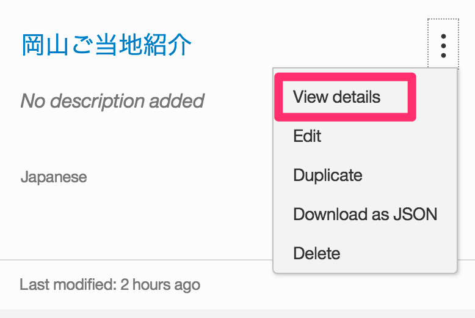
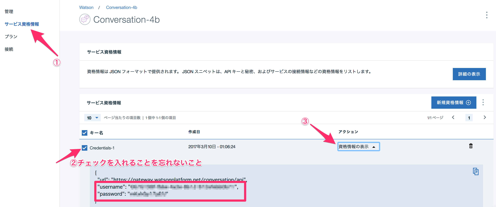

# LINE-Node-RED-bot
LINEとWatson Conversationを使ったbotサンプル

bot開発を行う上で、今やLINEは外せないプラットフォームとなりました。ここではbotの高速プロトタイプのためにNode-REDとWatsonを活用した開発手順を記します。


手順の流れ概要

1. Node-RED, Watson Conversation APIの準備
2. 会話の作成
3. LINEの準備
4. LINE ✕ Watson
----

## 1. Node-RED, Watson Conversation APIの準備

[こちら](https://github.com/Gitmorizumi/nodered-visualrecognition) の1.を参考にNode-REDを立てる。

上記のリンクの2.を参考にWatson Conversation APIを追加する。


## 2. 会話の作成

Watsonの会話の作り方の参考はこちらにいくつかご紹介します。

- [チャットボットを簡単に作れる！Watson Conversationの色々なTips（メモ）](https://qiita.com/ishida330/items/ae7277598cd3e08fc3a2)

- [Watsonに博多弁をしゃべらせてみた](https://qiita.com/asasaki/items/15e22f359da193669408)

Watson Conversationは会話をインポートすることができます。

まずはダッシュボードからConversationのサービスをクリック。


Watson ConversationサービスのGUIをLaunchします。


Watson ConversationのWorkplace画面が表示されるのでimportボタンからimportを行います。


予めgit cloneでこちらのリポジトリをクローンあるいはダウンロードしたらworkspace-okayamabot.jsonを指定してimportしてください。


## 3. LINEの準備

LINE developersに登録して諸々設定します。


次にfunctionやhttpリクエストのノードをドラッグ・アンド・ドロップして図のようにつなげる。


functionは以下の通りコードを記述していく。
LINEのAPI Referenceを参照しながら、messageが送られた際にwebhookにmessageをポストできるようにheaderの設定を行う。
Bearer xxxxの箇所は各個人のLine developersの設定画面にある「Channel Access Token」の値を入力する。

```js
var event = msg.payload["events"][0];
if(event["message"]["type"] != "text"){
    return msg;
}
var message = event["message"]["text"];
var replyToken = event["replyToken"];
var replyMessage = {"type": "text", "text": message}
msg.payload = {"messages": [replyMessage], "replyToken": replyToken};
msg.headers  ={"Content-Type": "application/json", "Authorization": "Bearer XXXXX"};

return msg
```

オウム返しが返答すれば設定完了。


## 4. LINE ✕ Watson

functionやconversationのノードをドラッグ・アンド・ドロップして図のように用意する。


まずはLINEからのポストリクエストを受けてWatson Conversationに投げるための処理を行います。
以下のようにコードを記述します。

```js
var event = msg.payload["events"][0];

msg.replyToken = event["replyToken"];
msg.payload = event["message"]["text"];
msg.params = {};
msg.params.workspace_id ="xxxxxx"
msg.params.username = "xxxxxx"
msg.params.password = "xxxxxx"
msg.params.endpoint = "https://gateway.watsonplatform.net/conversation/api"

return msg
```

このとき、workspace_id, username, passwordは個人の環境の値に設定してください。

- workspace_idの確認方法
Work ConversationのWorkspaceをlaunchした後に出てくる各Workspaceのドットメニューをクリックするとメニューが表示され、View detailsで確認できます。


サービス資格情報はダッシュボードから確認できます。非常にわかりにくいので注意してください。



次にConversationのプロパティを以下のように設定します。Workspace IDは上述した箇所から同じものの値をコピーしてください。


Watsonから返答されたメッセージをLINEにPOSTするための処理としてfunctionを以下のようにコードを記述します。
Bearer xxxxxxはLINE developer で確認したトークンです。（手順3.で使用したもの）

```js
var messageText = msg.payload.output.text[0];

msg.payload = {"messages": [{"type": "text", "text": messageText}], "replyToken": msg.replyToken};
msg.headers = { "Content-Type": "application/json", "Authorization": "Bearer xxxxxx"};
return msg
```

ご当地アプリを更に充実させてみてください。

以上